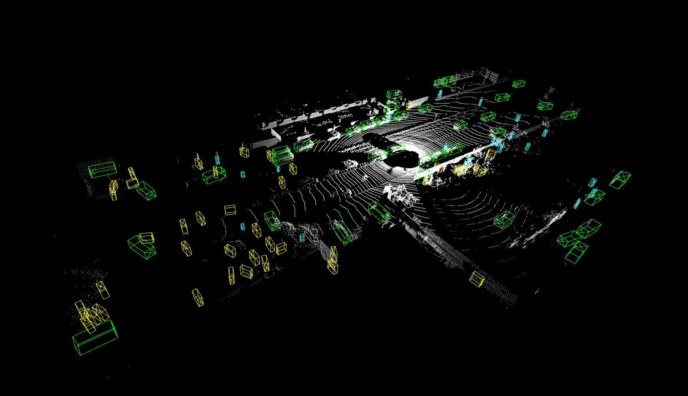
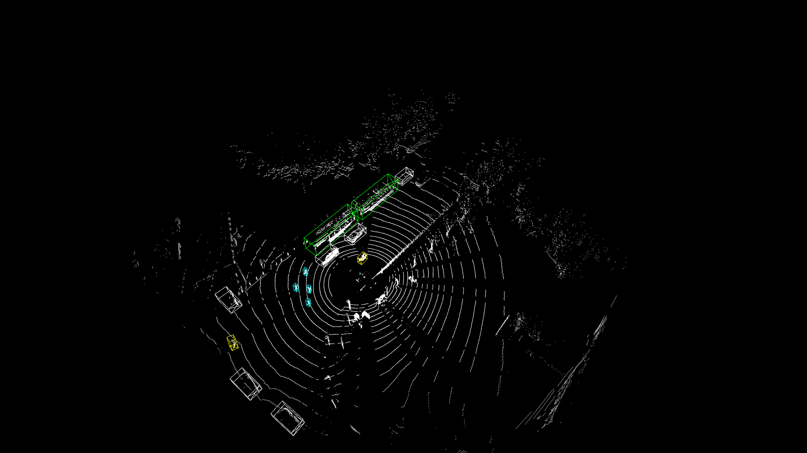
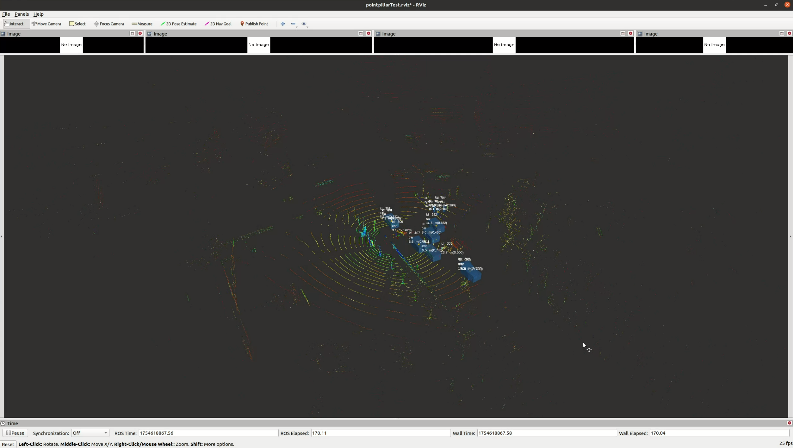

# 基于OpenPCDet训练模型（pointpillar、pointrcnn、pv_rcnn等3D检测模型）

## OpenPCDet Version: 0.6.0
[官网](https://github.com/open-mmlab/openpcdet),在新设备本地化部署进行训练，需要安装相关依赖包，
具体参考：[OpenPCDet官方文档](https://github.com/open-mmlab/OpenPCDet/blob/master/docs/GETTING_STARTED.md),
数据集：[kitti数据集](http://www.cvlibs.net/datasets/kitti/eval_object.php?obj_benchmark=3d)


##    **训练环境搭建:**

1.    **系统软硬件配置:**
   * Linux - Ubuntu20.04 LTS
   * INVIDA Driver : 535.183.01 
   * Python : 3.9.19  numpy = 1.26.0
   * PyTorch : 2.1.0
   * CUDA : 11.8
   * cudnn : 8.8.0
   * spconv : 2.3.6  --spconv-cu118
   * Miniconda3 : 4.9.2
   * conda 环境：python_3.9
      
2.    **依赖包 packages:**
   * easydict
   * torchvision : 0.16.0
   * scikit-image
   * av2
   * kornia


##    **模型导出环境搭建:**

1.    **系统软硬件配置:** 
   * Linux - Ubuntu20.04 LTS
   * INVIDA Driver : 535.183.01 
   * Python : 3.8.19  numpy = 1.24.4
   * PyTorch : 1.10.0
   * CUDA : 11.8  # 11.3
   * cudnn : 8.8.0
   * spconv : 2.3.6 --spconv-cu113
   * Miniconda3 : 4.9.2
   * conda 环境：pointpillars

2.    **依赖包:**
   * torch : 1.10.0+cu113
   * torchvision : 0.11.0+rocm4.1
   * torchaudio : 0.10.0+cu113
   * pip install torch==1.10.0+cu113 torchvision==0.11.0+cu113 torchaudio==0.10.0 -f https://download.pytorch.org/whl/torch_stable.html
   * pip install --upgrade onnx-simplifier==0.4.35 onnx==1.15.0    # 对应版本onnx

   (注：由于网络原因可能导致部分依赖库安装不成功，更换网络后重新安装依赖库或多试几次.模型训练和转换分别在不同的conda环境下进行，主要由于训练和转换时的pytorch版本不同,可以探索一下，应该可以统一环境。)


## kitti数据集训练&测试过程记录

1. **kitti数据集下载:**[kitti数据解析](https://blog.csdn.net/zyw2002/article/details/127395975) ；下载后的数据集需要放在指定路径下，具体参考：[OpenPCDet官方文档](https://github.com/open-mmlab/OpenPCDet/blob/master/docs/GETTING_STARTED.md)


###    **预处理:**

1. 根据自己需求，调整点云范围，需要注意的是x和y轴范围与voxel_size的比值需要是16的倍数，eg:（69.12+69.12）/0.16 /16= 54

2. kitti数据预处理(数据打包pkl，加速运算)

```bash

- python -m pcdet.datasets.kitti.kitti_dataset create_kitti_infos tools/cfgs/dataset_configs/kitti_dataset.yaml            # kitti
（注意：默认kitti数据集只对lidar坐标系x轴正向进行数据标注，x轴负向物体未进行标注）

```
 
###    **模型训练:**

1. **训练路径:**/home/user/ChangTing/Code/Openpcdet/OpenPCDet/tools/

2. **conda 环境:**python_3.9

```bash

- CUDA_VISIBLE_DEVICES=0 python train.py --cfg_file cfgs/kitti_models/ointpillar.yaml --batch_size 1 --workers 1 --epochs 10

- CUDA_VISIBLE_DEVICES=0 python train.py --cfg_file cfgs/kitti_models/pointpillar_lj.yaml --batch_size 4 --workers 4 --epochs 80

- CUDA_VISIBLE_DEVICES=0 python train.py --cfg_file cfgs/kitti_models/pv_rcnn.yaml --batch_size 1 --workers 1 --epochs 10

```


###    **模型验证:**

1. **验证路径:**/home/user/ChangTing/Code/Openpcdet/OpenPCDet/tools/
  使用训练好的pth模型验证数据集

```bash

- python test.py --cfg_file cfgs/kitti_models/pointpillar.yaml --batch_size 4 --ckpt ../output/kitti_models/pointpillar/default/ckpt/latest_model.pth

```


###    **模型推理:**

1. **推理路径:**/home/user/ChangTing/Code/Openpcdet/OpenPCDet/tools/
  使用pth模型推理单帧数据

<p align="center">
  
</p>

```bash

- python demo.py --cfg_file cfgs/kitti_models/pointpillar.yaml  --data_path ../data/kitti/testing/velodyne/000099.bin --ckpt ../output/kitti_models/pointpillar/default/ckpt/latest_model.pth

```


###    **模型导出:**

####    **pth to onnx:1** 

1. **pth to onnx 路径:**/home/user/ChangTing/Code/Openpcdet/Lidar_AI_Solution/CUDA-PointPillars/tool/

2. **conda 环境:**pointpillars

```bash

- python exporter.py --ckpt ./pth/checkpoint_epoch_100.pth 

```

####    **pth to onnx:2** 

1. **pth to onnx 路径:**/home/user/ChangTing/Code/Openpcdet/OpenPCDet/tools/export_onnx/

2. **conda 环境:**pointpillars

```bash

- python exporter.py --cfg_file ./cfgs/kitti_models/pointpillar_lj.yaml --ckpt ./pth/lj_10.pth 

```

####     **pth to onnx:3**

1. [说明]自定义模型进行训练，需要修改pointpillar.yaml文件,建议复制文件修改相关参数，如：检测范围、模型结构（体素数量、体素大小、先验框参数配置等）、数据集、检测类别等.在对训练好的pytorch模型进行ONNX转换时，需要根据pointpillar.yaml文件修改模型的输入、输出张量，具体见[simplifier_onnx.py]。


###    **模型部署:**

1. **模型部署路径:**/home/user/ChangTing/Code/Openpcdet/PointPillars_Ros/ 

2. [说明]基于CUDA、TensorRT部署pointpillar模型,结合ROS1进行3D目标检测并发布车辆坐标系下的目标检测结果，共有[autoware_msgs]、[detected_objects_visualizer]、[lidar_point_pillars]3个功能包、[部署参考](https://blog.csdn.net/h904798869/article/details/132411664),验证自定义模型范围时请修改Pointpillars/params.h文件中的MARK参数。

<p align="center">
  
</p>

```bash
 
 - cd /home/user/ChangTing/Code/Openpcdet/PointPillars_Ros
 
 - source devel/setup.bash
  
 - roslaunch lidar_point_pillars lidar_point_pillars.launch

```


## 自定义数据集训练

1.    **数据提取：**
[说明]：激光点云数据通过将ros点云话题保存为pcd文件，并转化为bin格式存储（为了适配kitti数据格式），自定义数据集处理工具[path:](OpenPCDet/dataset_tools/), bag2pcd用于将rosbag点云消息输出pcd文件，pcd2bin用于将pcd文件转换为bin文件。可以根据数据具体情况进行过滤处理，处理后的点云数据导入数据标注工具进行标注。

2.    **数据标注：**
[说明]：点云数据标注，标注工具[LabelCloud](https://blog.csdn.net/Shawn_1223/article/details/125823468?spm=1001.2014.3001.5501&login=from_csdn),数据标注选择kitti_untransformed格式，所有数据都是基于激光雷达坐标系下标注，不存在图像到Lidar坐标系数据转换,数据标注建议在windows环境下进行，具体使用事项参考链接。

3.    **数据预处理：**
[说明]：标注后的点云数据为labels和points两部分，数据存放在Openpcdet/data/custom/,该目录分为testing、training两个部分，testing下存放点云数据points, training下存放labels和points，然后利用自定义数据集处理工具[path:](OpenPCDet/dataset_tools/)dataSegment用于将标注的点云文件划分为train.txt, val.txt, test.txt, trainval.txt.数据处理主要调用/Openpcdet/pcd/datasets/custom/custom_dataset.py执行,参数配置文件/Openpcdet/tools/cfgs/dataset_configs/kitti_custom_dataset.yaml，文件已经过修改(后期如果训练自定义检测类别需要在文件在对应修改)。

```bash

custom
├── ImageSets
|   |—— test.txt
|   |—— train.txt
|   |—— val.txt
|   |—— trainval.txt 
├── testing
│   |—— points
├── training
│   |—— labels
│   |—— points

- python -m pcdet.datasets.custom.custom_dataset create_custom_infos tools/cfgs/dataset_configs/kitti_custom_dataset.yaml  # 数据打包为pkl文件

```

4.    **模型训练：**
[说明]：当数据集处理完成进入搭建好的的pytorch环境(conda)进行训练，/Openpcdet/tools/train.py, 模型参数配置文件/Openpcdet/tools/cfgs/kitti_models/pointpillar_custom.yaml, 模型验证时完全采用kitti格式，因此/Openpcdet/pcd/datasets/custom/中需要调用kitti_object_eval_python中的文件，其中val.py中的clean_data、get_official_eval_result中需要修改对应检测类别，文件已经过修改（后期如果训练自定义检测类别需要在文件在对应修改）。

```bash

- CUDA_VISIBLE_DEVICES=0 python train.py --cfg_file cfgs/kitti_models/pointpillar_custom.yaml --batch_size 2 --epochs 100 
(注：修改检测范围进行训练，需要重新编辑一份pointpillar.yaml与kitti_data.yaml文件，不能直接在原文件修改参数)

```

5.    **pth模型测试：**
[说明]：模型训练完成后保存在/Openpcdet/output/kitti_models/pointpillar_custom/default/中，调用/Openpcdet/tools/demo.py进行pth模型推理并可视化，其中demopy文件，自定义模型中的类别标签值从1开始，而kitti中需要从0开始，经过修改可正常调用。

<p align="center">
  
</p>

```bash

- python demo.py --cfg_file cfgs/kitti_models/pointpillar_custom.yaml --data_path ../data/custom/testing/points/000012.bin --ckpt ../output/kitti_models/pointpillar_custom/default/ckpt/checkpoint_epoch_100.pth

```

6.    **模型转化pth2onnx:**
[说明]：训练完成的pytorch模型需要转换为onnx模型用于onnxruntime推理，但本项目中用于车端部署，采用NVIDIA TenserRt进行模型推理，需要将模型转换为Eigen格式（部署代码中完成该步操作），pth2onnx需要切换到对应的pythorch环境（conda）pointpillars，将训练好的pth模型放在/Openpcdet/tools/export_onnx/pth/路径下，转换后的结果存放于/Openpcdet/tools/export_onnx/onnx/路径，模型转换工具/Openpcdet/tools/export_onnx/exporter.py,注意如果修改模型的检测类别或检测范围，需要同步修改simplifier_onnx.py（作用为优化模型节点，重组推理模型结构）中模型的张量，包括特征图尺寸、模型输入、输出张量以满足模型推理。

```bash

- python exporter.py --cfg_file ./cfgs/kitti_models/pointpillar_custom.yaml --ckpt ./pth/custom_100.pth 

```

7.    **模型部署：**
[说明]：本项目模型部署基于NVIDIA TensorRt进行模型推理，基于ROS中间件进行检测结果消息发布并可视化，Pointpillars_Ros工作空间下共有3个ros功能包，[autoware_msgs]：用于定义发布的消息类型，[detected_objects_visualizer]：用于可视化pointpillar模型推理结果，[lidar_point_pillars]：基于NVIDIA TensorRt进行模型推理，并发布推理结果消息，同时支持卡尔曼滤波跟踪、与基于距离的目标跟踪。将onnx模型放在/Pointpillars_Ros/src/lidar_point_pillars/model/路径下，并在launch文件中修改模型路径。（注意，如果修改自定义模型的类别和检测范围需要更改）/Pointpillars_Ros/src/lidar_point_pillars/include/params.h文件参数。

<p align="center">
  
</p>

```bash

- roscore

- rosbag play -l xxx.bag    # 发布对应点云消息

- catkin_make -j4 --pkg autoware_msgs

- catkin_make -j4 --pkg detected_objects_visualizer && catkin_make -j4 --pkg lidar_point_pillars && source devel/setup.bash

- roslaunch lidar_point_pillars lidar_point_pillars.launch

```


## 问题记录

1.    **ros环境冲突问题:**

Linux下安装miniconda3，启动ros节点时优先调用conda环境下的python环境而不是系统环境下的python环境，导致运行ros节点出现无法调用相关ros包的问题,临时解决如下：

```bash

- echo $PATH  # 查看系统默认调用环境

- PATH=:/xx/miniconda3/bin:/xx/xx  # 移除miniconda3环境

```


2.    **conda 环境下的lib库版本问题:**

```bash

- export LD_LIBRARY_PATH="/home/user/.conda/envs/python_3.9/lib/"

- sudo ln -s /lib/x86_64-linux-gnu/libffi.so.7.1.0 libffi.so.7  &&  sudo ldconfig

```

3.    **libstdc++.so.x版本问题：**

```bash

- strings /usr/lib/x86_64-linux-gnu/libstdc++.so.6 | grep GLIBCXX  # 查看libstdc++.so.6版本

- sudo find / -name "libstdc++.so.6*"  # 找到libstdc++.so.6.0.29路径

- sudo cp /xx/xx/xx/envs/xx/lib/libstdc++.so.6.0.29 /usr/lib/x86_64-linux-gnu/  # 复制libstdc++.so.6.0.29进行替换

- sudo rm /usr/lib/x86_64-linux-gnu/libstdc++.so.6  # 删除libstdc++.so.6链接

- sudo ln -s /usr/lib/x86_64-linux-gnu/libstdc++.so.6.0.29 /usr/lib/x86_64-linux-gnu/libstdc++.so.6  # 创建libstdc++.so.6软链接

```


## ubuntu20.04 网卡驱动问题

1. [网卡驱动问题](https://blog.csdn.net/weixin_52490336/article/details/133139105)
